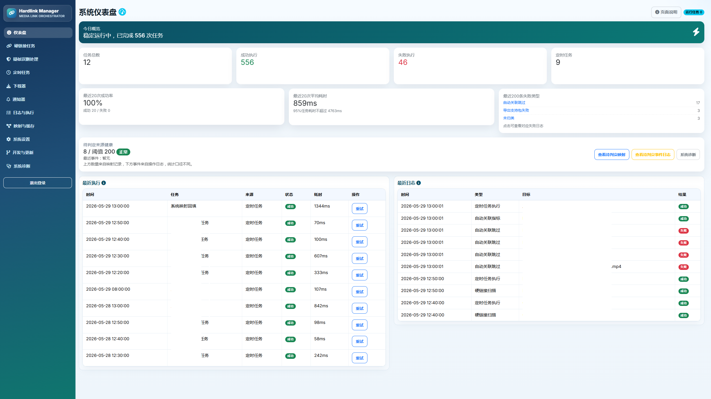

# 🎬 HLM-Demo

<div align="center">

# 🔗 Hardlink Manager · 媒体硬链接自动化中心

**让下载目录自动入库，让删除联动可控可靠。**  
**同时支持日常稳定使用与开发调试。**




</div>

> 当前版本：`v0.3.6`（2026-05-24）

---


## 🆕 最近更新说明（v0.3.6）

### 主要更新
- 发布维护与一致性修正：完成版本元信息与发布链路同步，触发 `v0.3.6` 自动构建。
- 开发模式自动拉取链路延续稳定：重启后按页面配置执行远端强制对齐（`fetch + reset --hard + clean -fd`），减少“文件未覆盖”问题。
- 诊断页增强延续：数据库容量、日志占用、迁移状态与关键可写性检查能力保持可用。
- UI 全局精修延续：下载器/通知器列表对齐、移动端卡片化与复制交互保持稳定。

### 对普通用户的影响
- 日常部署方式不变，仍是开箱即用。
- 只需修改少量基础信息即可运行：`SECRET_KEY`、登录账号密码、媒体目录映射。
- 不使用开发模式时可保持默认关闭，不影响常规功能。

---

## 🎯 适用人群

- **日常使用者**：希望开箱即用、少折腾，复制 Compose 后只改少量个人信息即可启动。
- **开发调试者**：希望重启即拉取最新代码，减少频繁打包构建成本。

---

## ✨ 主要能力

- 🧠 多任务硬链接：电影/剧集/动漫等独立任务管理
- 🔁 自动化执行：手动执行 + 定时 Cron 双模式
- 🧹 删除联动：支持冷却、阈值、试运行、通知
- 🛡️ 待判定保护：减少映射重建窗口期误删风险
- 📦 映射/缓存管理：筛选、重试、批量清理
- 🪵 日志与诊断：方便定位配置与运行问题
- 🩺 诊断支持包：可导出脱敏后的运行诊断信息（Support Bundle）
- 💾 备份恢复增强：备份校验、恢复前预检、恢复前自动留底
- 🔌 API 与 Webhook：提供基础 JSON 接口与可选事件推送

---

## ⚠️ 重要运行规则（本版本建议）

- **不新增 Docker 环境变量作为新功能配置入口**。  
  新增运行时能力统一通过“页面配置 + 数据库配置”生效。
- `RBAC / 只读模式 / IP 白名单 / 2FA / 关键操作口令 / Webhook` 均为**可选功能**，默认关闭，不强制配置。
- Compose 里的环境变量建议保持“启动基础项”（如 `SECRET_KEY`、登录凭据、时区）即可。
- 开发模式统一由页面配置控制（保存后写入 `instance/dev_runtime.env`），不再依赖 Compose 环境变量开关。

---

## 🗺️ 页面说明（建议先读）

- 🏠 **仪表盘**：总览状态、近期执行、快捷入口
- 🔗 **硬链接任务**：源目录/目标目录/扩展名/删除联动
- 🧹 **疑似误删处理**：处理待确认的风险删除记录
- 🧭 **映射与缓存**：查看来源、重试关联、批量管理
- ⏰ **定时任务**：统一调度入口
- ⚙️ **系统设置**：白名单、通知、版本检查、备份
- 🔍 **系统诊断/日志**：问题排查入口

---

## 🔁 备份与恢复（推荐操作顺序）

1. 进入“系统诊断 -> 备份与恢复”，先查看备份状态与校验结果。  
2. 若要恢复，先点“预览”确认该备份可恢复。  
3. 再执行“恢复”（如配置了关键口令需输入）。  
4. 系统会在恢复前自动对当前数据库做一份留底备份（`restore-preflight` 目录）。  

说明：
- 恢复流程包含路径合法性检查（防止路径越界）与备份完整性校验。
- 支持包导出和配置导出均会对敏感字段做脱敏处理（`***`）。

---

## 🔐 可选安全策略（默认关闭）

- 只读模式：限制高风险写操作入口。
- IP 白名单：支持单 IP 与 CIDR。
- 2FA / RBAC：预留配置项，按需启用。
- 关键操作口令：用于恢复、批量高风险操作等二次确认。

这些策略均可单独启用/关闭，不影响未启用场景的基础使用流程。

---

## 🔌 API 与自动化入口（概览）

当前可用的基础 JSON 接口：

- `GET /api/health`：健康检查
- `GET /api/tasks/status`：任务开关状态
- `GET /api/runtime/summary`：运行摘要（配置状态、近期日志、运行任务）
- `POST /api/webhooks/test`：Webhook 测试（需先在设置页启用并配置 URL）
- `GET /diagnostics/backfill-metrics`：自动关联指标
- `GET /diagnostics/support-bundle?format=zip|json`：导出诊断支持包（脱敏）

---

## 🚀 一键部署（推荐：日常稳定使用）

### 第 1 步：创建目录

```bash
mkdir -p hlm-demo && cd hlm-demo
```

### 第 2 步：创建 `docker-compose.yml`

> 下面这份是**普通用户最简版**，开箱即用。你只需要改这几项：
> 1) `SECRET_KEY`  2) `APP_USERNAME`  3) `APP_PASSWORD`  4) `/你的媒体目录`

```yaml
services:
  hlm:
    image: ghcr.io/marod1m/hlm-demo:latest
    container_name: hlm-demo
    restart: unless-stopped

    ports:
      - "5000:5000"

    environment:
      SECRET_KEY: "请改成一个长随机字符串"
      APP_USERNAME: "admin"
      APP_PASSWORD: "123456"
      TZ: "Asia/Shanghai"
      PYTHONUNBUFFERED: "1"

    volumes:
      - ./data/instance:/app/instance
      - ./data/backups:/app/data/backups
      - ./data/logs:/app/data/logs
      - /你的媒体目录:/media
```

### 第 3 步：启动

```bash
docker compose up -d
```

### 第 4 步：访问

- 本机：`http://127.0.0.1:5000`
- 局域网：`http://你的主机IP:5000`

### 第 5 步：首次建议操作

1. 先创建一个测试硬链接任务，验证路径与命名规则。  
2. 确认无误后再创建生产目录任务。  
3. 删除联动先开启“试运行”，观察日志后再切正式执行。

---

## 🧪 开发调试部署（页面配置优先）

适用于“经常改代码、需要快速验证”的场景。

### 配置方式（重要）

- 开发模式仅通过页面配置（系统设置 -> 开发模式）控制。
- 保存后写入 `instance/dev_runtime.env`，容器重启时读取并生效。
- Compose 不需要再配置开发模式开关相关环境变量。

### 开发模式 Compose 示例（无开发环境变量）

```yaml
services:
  hlm:
    image: ghcr.io/marod1m/hlm-demo:latest
    container_name: hlm-demo-dev
    restart: unless-stopped
    network_mode: bridge

    ports:
      - "5000:5000"

    environment:
      SECRET_KEY: "请改成一个长随机字符串"
      APP_USERNAME: "admin"
      APP_PASSWORD: "123456"
      TZ: "Asia/Shanghai"
      PYTHONUNBUFFERED: "1"


    volumes:
      - ./data/instance:/app/instance
      - ./data/backups:/app/data/backups
      - ./data/logs:/app/data/logs
      - ./data/devsrc:/app-devsrc
      - /你的媒体目录:/media
```

### 页面里配置的推荐项（系统设置 -> 开发模式）

建议在页面中维护这些项（更友好，也更安全）：

- `dev_auto_pull`
- `dev_git_repo`
- `dev_git_branch`
- `dev_auto_pip_sync`
- `dev_pip_sync_timeout`
- `dev_git_token`（脱敏显示，留空保持，支持显式清空）
- `dev_proxy_url`
- `dev_no_proxy`

### 首次开箱流程（开发模式）

1. 用上面的 Compose 启动容器。  
2. 打开“系统设置 -> 开发模式”，填写仓库/分支/自动拉取等参数并保存。  
3. 保存开发模式设置后，手动重启容器；重启后加载 `instance/dev_runtime.env` 页面配置。

### 代理说明（避免踩坑）

- 容器内不要把代理写成 `127.0.0.1`（那是容器自己）。
- 推荐使用：
  - `host.docker.internal:端口`，或
  - 宿主机局域网 IP:端口

---

## 📁 路径规则（最容易填错）

页面中的路径必须是**容器路径**：

- ✅ `/media/downloads/movie`
- ❌ `/volume1/media/downloads/movie`

---

## 🧩 任务模板（可直接照抄）

- 电影：`/media/downloads/movie -> /media/library/movie`
- 剧集：`/media/downloads/tv -> /media/library/tv`
- 动漫：`/media/downloads/anime -> /media/library/anime`

---

## 🔐 登录机制（务必理解）

- 同时设置账号和密码：启用登录页
- 任一为空：不强制登录
- 修改账号密码：改 Compose 后重启容器
- 账号密码不写入数据库

---

## 🧯 常见问题

### Q1：为什么我访问 `/login` 会回首页？
因为你没有同时设置 `APP_USERNAME` 和 `APP_PASSWORD`。

### Q2：为什么自动拉取没生效？
优先检查“系统设置 -> 开发模式”里的页面配置：
1. `dev_mode=true`
2. `dev_auto_pull=true`
3. `dev_git_repo` 地址可访问

补充：开发模式自动拉取在重启后会执行“强制对齐远端”流程（`git reset --hard` + `git clean -fd`），因此旧的未跟踪残留文件不会继续保留。
若远端拉取失败，容器会回退使用镜像内代码启动，避免服务不可用。

### Q3：代理已经配置，为什么还拉不到？
你可能用了 `127.0.0.1`。容器里请改为：
- `host.docker.internal:端口` 或
- 宿主机局域网 IP:端口

### Q4：导入/导出会泄露关键口令吗？
导出会隐藏关键口令；导入仅覆盖支持的配置项。

---

## 🧑‍💻 本地开发（非 Docker）

```bash
python3 -m venv .venv
.venv/bin/python -m pip install -r requirements.txt
.venv/bin/python app.py
```

---

## 📦 项目结构

```text
app.py
core/
  models.py
  deps.py
  routes/
    web.py
    api.py
  services/
    config_service.py
    audit_service.py
    execution_service.py
    migration_service.py
    hardlink_service.py
    delete_service.py
    backfill_service.py
    backup_service.py
    operation_guard_service.py
    diagnostics_service.py
    security_service.py
    webhook_service.py
    runtime_config_service.py
templates/
static/
scripts/
docker-compose.yml
docker-compose.prod.yml
```
